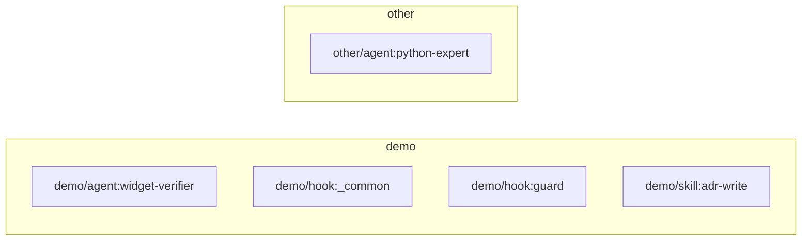

# Template Catalog Dependency Graph

Auto-generated by `awesome_templates graph` from the actual content of `templates/**` - do not hand-edit; regenerate instead.

## Cross-category edges

Entities that reference something outside their own category - worth a second look, since it means selecting the source's category without the target's category ships a dangling reference.

(none found)

## Missing references

These files are referenced in the catalog but do not exist on disk.

(none detected)

## Nodes with no detected references

Nothing in the scanned entity content points at these - either a true leaf (fine) or only referenced from settings.json / docs, which this scan does not read.

- `agents:demo/widget-verifier`
- `hooks:demo/_common`
- `hooks:demo/guard`
- `skills:demo/adr-write`
- `agents:other/python-expert`
